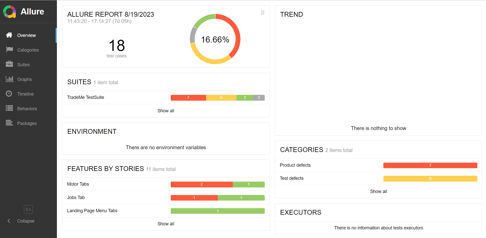
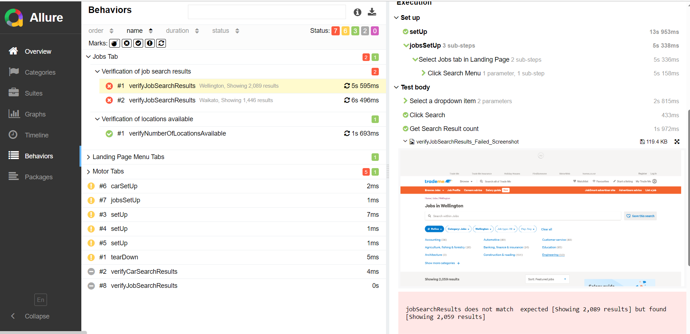

# Trademe Website Test Automation Framework

This repository contains a test automation framework developed using Selenium WebDriver, TestNG and Maven to perform automated testing on the Trademe website.
This uses Page Object Model and Page Factory pattern.
Allure reporting has been used to serve the reports in the HTML format.
Please note, this is a sample testing project that executes only a few test cases. 

## Project Structure

The project follows a structured layout to enhance maintainability and organization:

The test folder consists of separate packages for drivers, page objects, utils, and the tests. 

Base Test class consists of the basic setup needed to perform tests. Driver package holds the Driver Manager Factory and Driver Managers for different browser types.
Base tab holds common methods to be used in tabs. 
Utils consists of Test Config, Test Listener(configuring allure reports) and Wait Helper.  

Resources package - The resources package consists of the drivers, test properties file and testng.xml files.

## Prerequisites- 

Java, IDE (Any IDE - Intelli J, Eclipse etc.), Allure

## Project Setup and Test Execution - 
1. Clone repository in your local.
2. The drivers are downloaded and added in the resources. if they had to be changed, please ensure the
   path is mentioned in the respective driver manager. 
3. If the browser needs to be changed, please change in the test properties file. 
4. Change test data added in the data driven tests, if needed. 
5. Run the tests using TestNG by executing the testng.xml file. 
6. Type in Command "allure serve" to see the reports in HTML format. 

## Allure Reports Overview -
1. Epic and Stories view is depicted.Overall pass percentage and trend will be displayed.
2. Description, Steps of test cases, screenshot in case of failure are displayed. 

